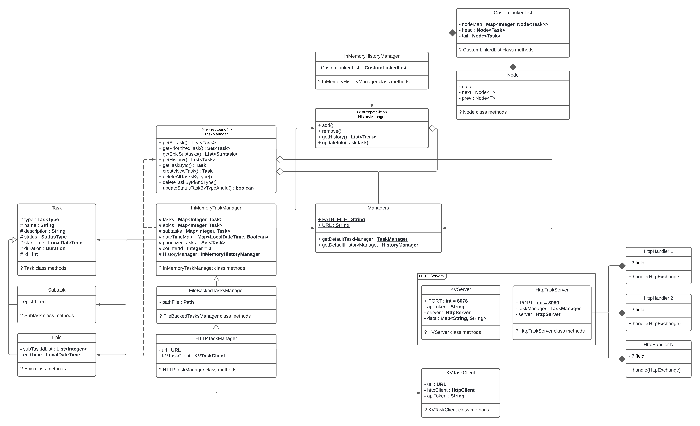

# java-kanban

Проект 3-го модуля Яндекс Практикума.

Таск-менеджер - это REST сервис для создания, управления различными типами 
задач, а также хранения их истории. Менеджер умеет сериализовать и 
десериализовать свое состояние в CSV файл и HTTP сервер.

- Хранение истории реализованно на основе своей реализации Linked List.
- REST API архитектура реализованна через Java HttpServer.
- При сериализации в файл и на HTTP сервер происходит полный перенос состояния менеджера (задачи, история, счетчики).
- Присутствует вывод приоритетных задач.
- Выполнение (время и статус) Epic задач зависит только от их внутренних подзадач. 